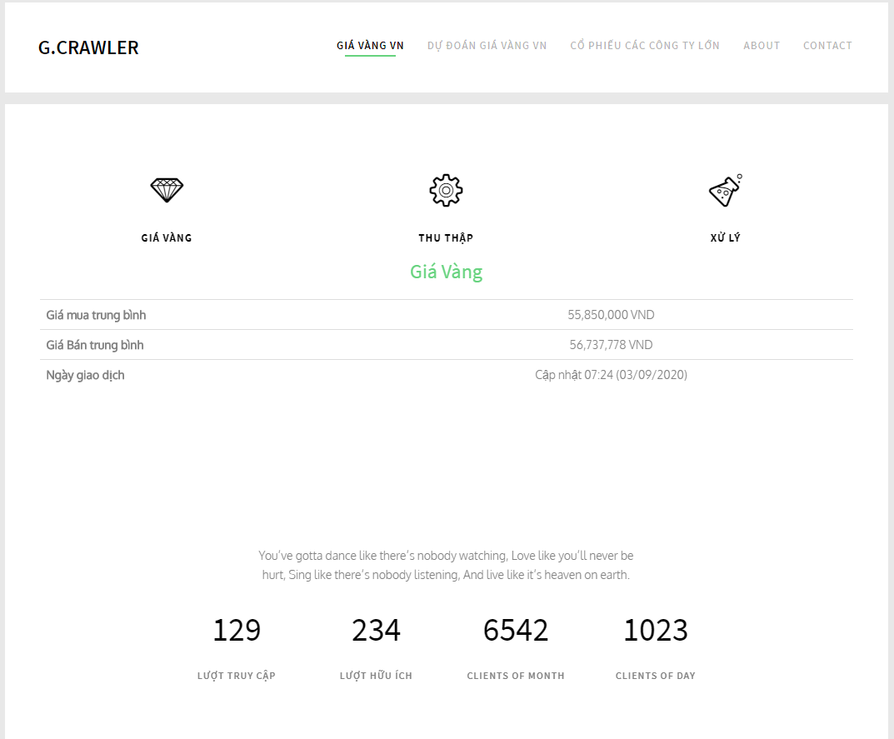
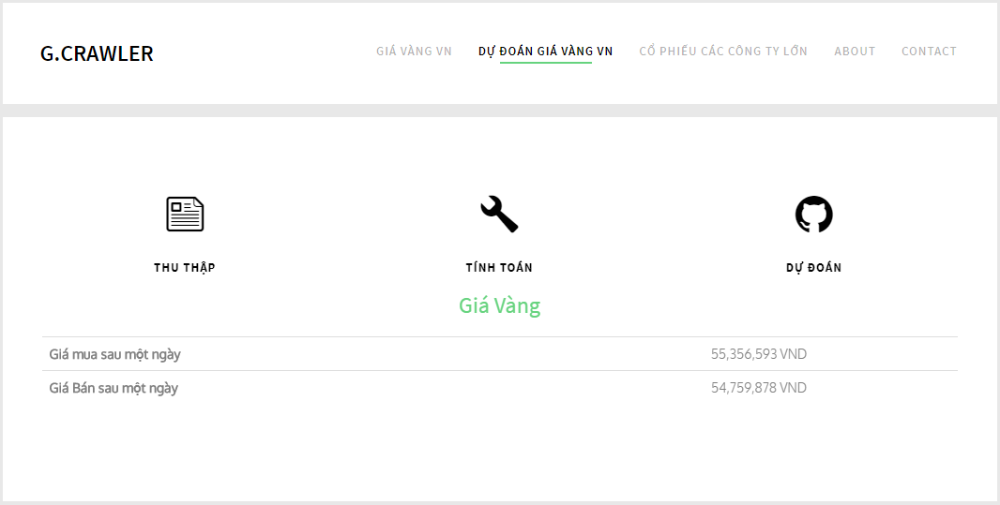

<h1 align="center">Welcome to golden Crawler 👋</h1>
<p>
  <a href="https://www.npmjs.com/package/golden Crawler" target="_blank">
    
  </a>
  <a href="https://github.com/anhtuanit1999/crawlgiavang#readme" target="_blank">
    
  </a>
</p>

>Golden Crawler is a Web app written to collect domestic gold price data from reputable sources, and then build a linear regression equation to predict the price of gold based on the collected data. I write this app to synthesize the knowledge I have learned.

### 🏠 [Homepage](https://github.com/anhtuanit1999/crawlgiavang#readme)

### ✨ [Demo](https://giavang-gc.herokuapp.com/)

## 1. Golden Price


## 2. Prediction


## Install

```sh
npm install
```

## Usage

```sh
npm start
```

## Author

👤 **Anh Tuan**

* Github: [@anhtuanit1999](https://github.com/anhtuanit1999)
* Facebook: [@AnhTuanIT](https://www.facebook.com/ATuanIT/)
* Instagram: [@_myrzo_](https://www.instagram.com/_myrzo_/)

## 🤝 Contributing

Contributions, issues and feature requests are welcome!

Feel free to check [issues page](https://github.com/anhtuanit1999/crawlgiavang/issues). 

## Show your support

Give a ⭐️ if this project helped you!

***
_This README was generated with ❤️ by AnhTuanIT_